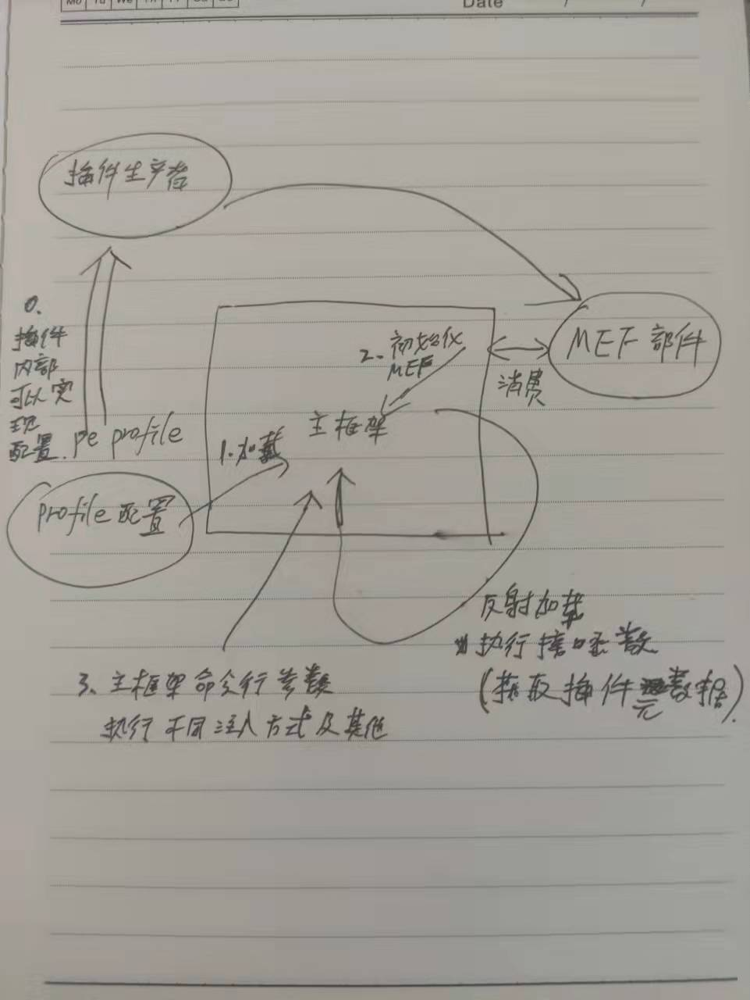

# ProcessInjecting
Process Injection Collection via C#

> 关于注入技术使用C#实现的集合，未来希望能更全面一点，然后就是Evasion等手段的使用 () => DInvoke,SYSCALL等
> 命令行参数Example: 
> -p ProcessHollowing -d Demo -y Profile.yaml

> 目前MEF解析引擎是在ProcessInjecting内部InitMEF nested status，后面会考虑重构。
> ProcessInjectionDemo更多算是一个临时区域，用以熟悉这些注入技术的实现以及原理；然后由插件生产者产生标准插件供主框架使用。
> 我简单画了个图，便于理清楚整个逻辑。(字太丑，勿怪)




> 目录介绍

```
Plugins 插件目录   基于MEF导出锲约生产插件供 ProcessInjecting主框架消费使用
MEFEngine MEF插件解析引擎,打算作为插件生产者和消费者中间代理的，后面再改把，现在啥用也没有。
Models 各种数据结构定义
PEProfiles 解析pe profile; 执行注入技术时,直接将对象作为参数传入提升执行的扩展性
ProcessInjecting 主框架 
ProcessInjectionDemo  tmp临时解决方案，学习注入技术用的。
UnitTestProject1 单元测试，暂时没啥用。
```

> 项目初衷

```
打算将注入技术总结性学习同时为其他朋友提供参考资料，代码里面也提供了元数据作为参考来源; 然后就是锻炼锻炼代码规整或者说设计能力，后面可能会考虑使用设计模式来重写，
总之这是一个长期维护的项目，欢迎喜欢.NET的伙伴一起学习。

```


## 命令帮助
> 
> -p 指定要执行的哪一种注入技术 目前支持的由插件支持Plugins目录下
> 
> -d Demo 目前仅仅设置了这一项 为了演示注入技术的效果
> 
> -y Profile.yaml 使用pefile 
> 
> 里面内置了是否使用RWX内存,Dinvoke,是否使用syscall以及是否使用地狱之门方式的系统调用,然后就是常规的evasions技术 blockdlls,bypass amis,etw等
> 
> 目前打算先实现功能,注入技术原理理解的差不多了再考虑使用profile里面这些规避技术。
```
  -p, --processkind    Required. Process Injection's type [ ProcessHollowing |  ProcessDoppelganging | ModuleStomping ]

  -d, --demo           Required. Show you one demo for the specified process injection technique

  -y, --profile        Required. Opsec for Process Injection

  --help               Display this help screen.

  --version            Display version information.

Example: 
-p ModuleStomping -d Demo -y Profile.yaml
```


## Module Stomping

```
======解析profile======>
userwx:True
syscall:False
syscall:False
hellgates:False
patchAmsi:False
patchEtw:False
Blockdlls:False
XOR:15
sleep_time:5000
spwanto:c:\\windows\\system32\\rundll32.exe
NtReadVirtualMemory
NtAllocateVirtualMemory
NtWriteVirtualMemory

Name:           Module Stomping
Description:    Module Stomping (which also seems to by the names Module Overloading and Dll Hollowing)is a shellcode injection technique
References:
                https://github.com/countercept/ModuleStomping
                https://blog.f-secure.com/hiding-malicious-code-with-module-stomping/
                https://offensivedefence.co.uk/posts/module-stomping/
                https://www.ired.team/offensive-security/code-injection-process-injection/modulestomping-dll-hollowing-shellcode-injection
Principles:
                1. Create a process or open a handle to an existing process
                2. Fore that process to load a legitimate DLL from disk
                3. Write the shellcode somewhere into the DLL
                4. Kick off execution using CreateRemoteThread or other (eg.UserQueueAPC also works)
Invoke Module Stomping

```
